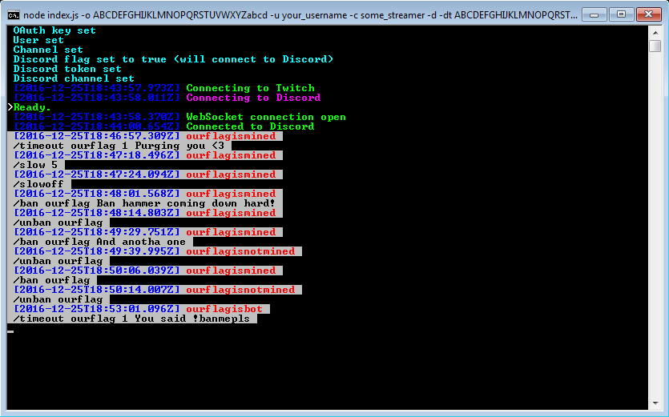

# Twitch Mod Log

Uses Twitch's PubSub system to log moderator actions in a channel.
Must be a moderator in the channel to log moderator actions.
Logs to file. Optionally logs to a discord channel of your choice.


## How to setup

`npm install`


## How to use (config file)

Edit the `config.json` file and fill in your details.


## How to use (command-line)

```plaintext
Usage: node index.js [options] 

Options:
  -h,        --help                    prints help message
  -co,       --colorless,              use colorless mode
  -nc,       --no-colors               (overrides colorless in config file)
  -o (...),  --oauth (...)             set user oauth key
                                       (overrides oauth key in config file)
  -u (...),  --user (...),             set user
             --username (...)          (overrides user in config file)
  -c (...),  --channel (...),          set channel
             --chan (...)              (overrides channel in config file)
  -p,        --purge,                  purge mod log file
             --purge-log,              (WARNING: THIS WILL ERASE YOUR LOG FILE)
  -d,        --discord,                relay mod actions to a Discord channel
                                       (overrides discordEnable in config file)
  -nd,       --no-discord,             don't relay mod actions to a Discord channel
                                       (overrides discordEnable in config file)
  -dt (...), --discord-token (...)     Discord token
                                       (overrides discordToken in config file)
  -dc (...), --discord-channel (...),  Discord channel
             --discord-chan (...)      (overrides discordChannel in config file)
```


## To-do

- Web server for displaying the logs, with sort-options
- Log chat messages, and display the last messages sent before a timeout/ban, to give context to moderators' actions
- More testing


## Warnings

Currently in alpha; bugs may exist. Report bugs, help contribute to its development, help improve the readme; all are welcome!

TAKE MODERATOR ACTIONS WITH A GRAIN OF SALT!

Unless you know the context of a moderator's action (what prompted it / what  said in chat / any other reason for doing it), don't jump to any conclusions.


## Screenshots



<br>
**Resulting `mod-log.txt` file:**<br>
```plaintext
[2016-12-25T18:46:57.309Z] ourflagismined: /timeout ourflag 1 Purging you <3
[2016-12-25T18:47:18.496Z] ourflagismined: /slow 5
[2016-12-25T18:47:24.094Z] ourflagismined: /slowoff
[2016-12-25T18:48:01.568Z] ourflagismined: /ban ourflag Ban hammer coming down hard!
[2016-12-25T18:48:14.803Z] ourflagismined: /unban ourflag
[2016-12-25T18:49:29.751Z] ourflagismined: /ban ourflag And anotha one
[2016-12-25T18:49:39.995Z] ourflagisnotmined: /unban ourflag
[2016-12-25T18:50:06.039Z] ourflagismined: /ban ourflag
[2016-12-25T18:50:14.007Z] ourflagisnotmined: /unban ourflag
[2016-12-25T18:53:01.096Z] ourflagisbot: /timeout ourflag 1 You said !banmepls
```
